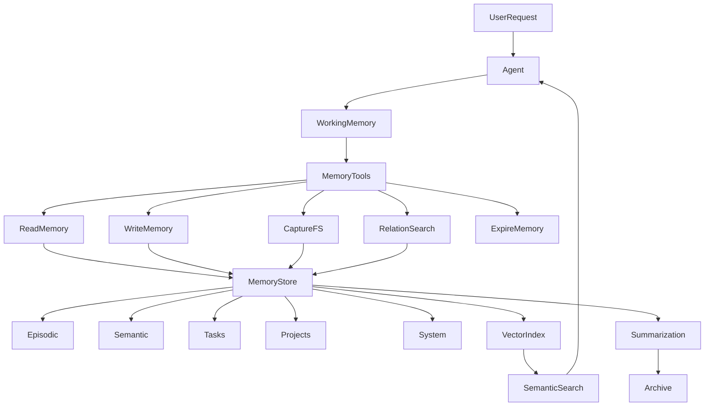
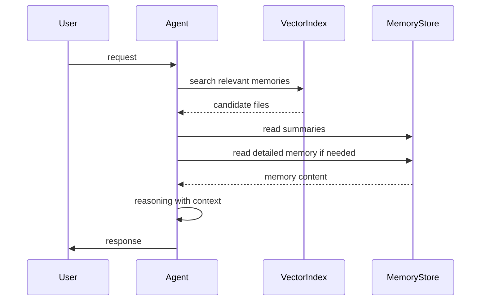

# Memory Architecture

## Overview

This document describes a **filesystem-based long-term memory architecture for autonomous agents**.
The goal is to give an agent persistent knowledge, structured context retrieval, and the ability to evolve its understanding over time.

The architecture combines:

- **Filesystem storage** (human-readable memory)

- **Timeline logs** (episodic memory)

- **Relations between memories** (knowledge graph)

- **Semantic retrieval** (vector search)

- **Memory compression and summarization**


This creates a **scalable memory system** that allows an agent to:

- remember past interactions

- connect related knowledge

- retrieve relevant context efficiently

- compress and archive old memories

- maintain long-term learning.


---

# 1. Core Memory Concepts

The memory system is built around **five key ideas**.

### 1. Persistent Memory Files

All knowledge is stored in **markdown files** on disk.

Advantages:

- easy debugging

- version control friendly

- human readable

- easy for agents to manipulate


Each file represents a **single memory unit**.

Example:

```
memory/projects/openlist.md
memory/tasks/todo.md
memory/knowledge/python.md
```

---

### 2. Timeline-Based Memory

Instead of overwriting information, memories are **appended as time blocks**.

This allows the agent to track **how knowledge evolves over time**.

Example memory file:

```
title: Openlist Project
description: Waitlist-as-a-service platform
created: 2026-02-01
last_used: 2026-04-15
importance: 8

---

@latest
Current focus: improving referral system
Next step: add leaderboard ranking

@relation: ["referrals.md", "analytics.md"]

---

@2026-04-10
Added QR code waitlist sharing.

---

@2026-04-01
Initial waitlist system created.
```

Benefits:

- preserves historical context

- prevents knowledge loss

- allows summaries of older entries.


---

### 3. Memory Relations (Knowledge Graph)

Memories can reference other memories using **relations**.

Example:

```
@relation: ["referrals.md", "analytics.md"]
```

This creates a **graph structure** where the agent can navigate related knowledge.

Example relation flow:

```
project.md
   ├─ relation → meeting_notes.md
   ├─ relation → tasks.md
   └─ relation → roadmap.md
```

This enables **context expansion during reasoning**.

---

### 4. Memory Types

Memories are organized into categories to improve retrieval.

Directory structure:

```
memory/
 ├── episodic/
 ├── semantic/
 ├── tasks/
 ├── projects/
 └── system/
```

### Episodic Memory

Events or experiences.

Example:

```
agent solved bug
user conversation
deployment event
```

---

### Semantic Memory

Facts the agent has learned.

Example:

```
API documentation
framework knowledge
system rules
```

---

### Task Memory

Active goals and task state.

Example:

```
pending tasks
in-progress jobs
todo lists
```

---

### Project Memory

Long-term structured work.

Example:

```
product development
startup planning
research projects
```

---

### System Memory

Internal agent state.

Example:

```
agent configuration
tool usage patterns
execution history
```

---

# 2. Memory Metadata

Each memory file includes metadata to help the agent manage information.

Example:

```
title: Example Memory
description: description of the memory
created: timestamp
last_used: timestamp
importance: 1-10
confidence: 0-1
```

### Importance

Measures how critical the memory is.

```
importance: 9
```

Used for:

- prioritizing retrieval

- deciding summarization

- preventing deletion of critical knowledge.


---

### Confidence

Indicates reliability of information.

```
confidence: 0.7
```

Useful when:

- agent learns uncertain information

- information comes from external sources.


---

# 3. Agent Memory Tools

The agent interacts with memory using **structured tools**.

These tools act as the interface between the agent and the memory system.

---

## Capture Tool

Captures the filesystem structure and metadata.

Purpose:

- provide the agent a visual representation of available memory

- enable discovery of related knowledge.


Example output:

```
projects/
   openlist.md
tasks/
   todo.md
knowledge/
   api_docs.md
```

---

## Read Tool

Reads a memory file.

Default behavior:

- returns the **latest section**.


Optional:

- return full history

- return specific time blocks.


---

## Write Tool

Adds new memory entries or updates metadata.

Instead of editing existing entries, it **appends new timeline blocks**.

Example:

```
@2026-04-15
User requested leaderboard analytics feature.
```

---

## Relation Tool

Finds connections between memories.

Possible queries:

```
find relations for project.md
find files referencing referrals.md
```

This allows the agent to **expand context automatically**.

---

## Expire Tool

Manages aging memories.

Instead of deleting information, the system:

```
old logs → summarized → archived
```

This prevents loss of important knowledge.

---

# 4. Semantic Retrieval Layer

When the memory base grows large, scanning all files becomes inefficient.

A **vector index** is used for semantic search.

Process:

```
query → embedding → vector search → candidate memories → LLM reads them
```

This allows the agent to retrieve relevant memories even when the query wording differs.

Example:

User query:

```
referral growth strategy
```

Vector search may return:

```
referrals.md
leaderboard.md
growth.md
```

---

# 5. Memory Summarization Layer

Older logs are compressed into summaries.

Structure:

```
memory/
memory_summary/
archive/
```

Example summary file:

```
Project: Openlist

Goal:
Build waitlist infrastructure for startups.

Current State:
Referral system implemented.

Key Decisions:
- leaderboard ranking
- QR waitlist sharing
```

Benefits:

- reduces token usage

- speeds up retrieval

- keeps important information accessible.


---

# 6. Memory Lifecycle

Memories move through stages.

1. **Creation**


Agent writes a new entry.

2. **Usage**


Memory is accessed during reasoning.

3. **Growth**


Additional logs are appended.

4. **Summarization**


Older logs are compressed.

5. **Archival**


Compressed logs are stored for long-term storage.

---

# 7. System Architecture Diagram



---

# 8. Memory Retrieval Flow



---

# 9. Advantages of This Architecture

### Transparent

All memories are human-readable.

### Scalable

Semantic search allows thousands of memories.

### Structured

Relations create a knowledge graph.

### Efficient

Summaries reduce context load.

### Persistent

Agent knowledge survives restarts.

---

# 10. Future Improvements

Possible upgrades:

- automated importance scoring

- automatic relation discovery

- graph database layer

- reinforcement learning for memory prioritization

- adaptive summarization strategies.


---

✅ This architecture provides a **robust long-term memory system for autonomous agents**, combining filesystem storage, semantic retrieval, and structured relationships.

---

